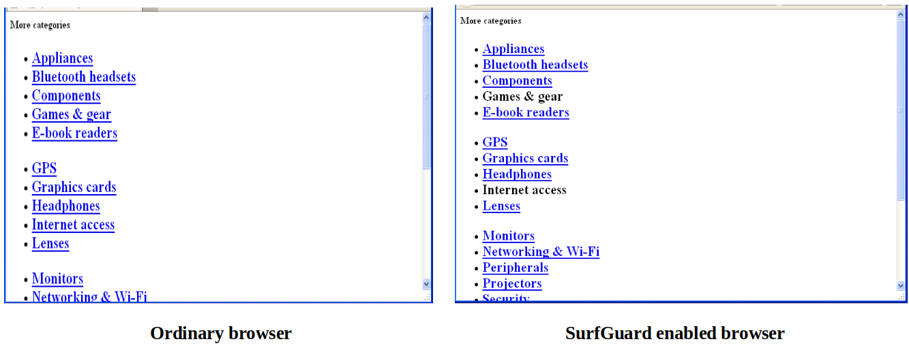
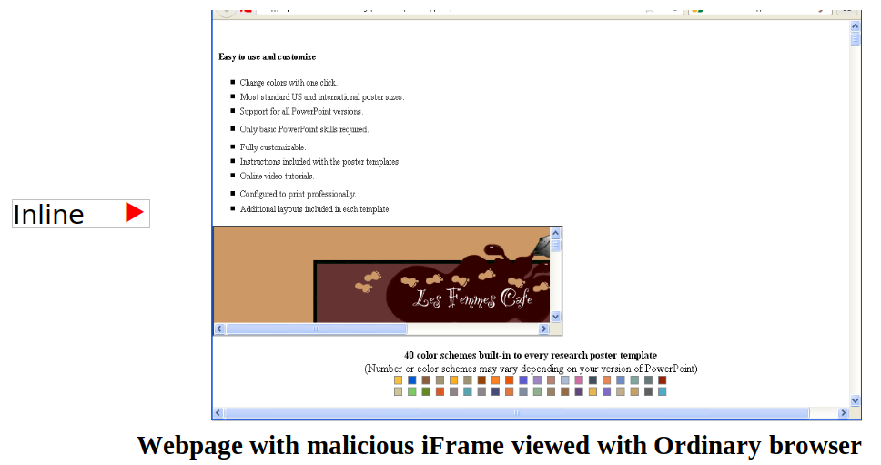
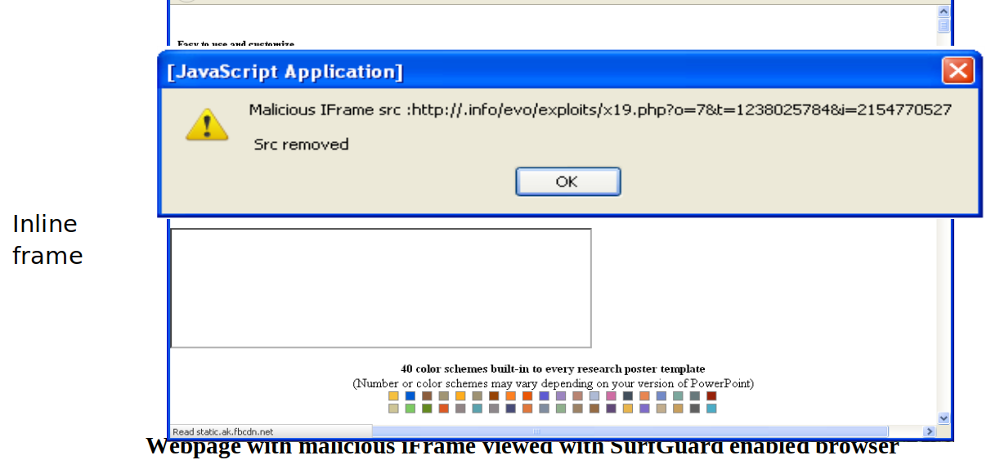

# Surfguard

## Introduction
Drive-by downloads refer to malicious software that is automatically downloaded onto a user's computer upon visiting a website. These downloads exploit vulnerabilities in the browser or operating system, often without the user's awareness. They can occur through unpatched systems or by deceiving users into thinking they're downloading legitimate software. The stealthy nature of drive-by downloads makes them particularly hazardous, as they install software without the user's consent or knowledge. Website owners are often unaware that their sites are facilitating these attacks, posing a serious threat to their customers' security.

To counter such threats, two main approaches have been developed: Signature-based and Behavior-based systems. Signature analysis involves matching webpages against exploit databases, which may fail to detect new viruses not yet cataloged. In contrast, Behavioral analysis focuses on detecting abnormal behavior, making it effective against zero-day attacks. 

SurfGuard, a defense mechanism, operates at the browser level and employs behavioral analysis to identify malicious webpages. By intercepting native JavaScript APIs commonly used in exploits, SurfGuard can detect and mitigate various threats including heap spray exploits, malicious redirections, and suspicious links. Developed as a JavaScript tool, SurfGuard is platform-compatible and currently works on Mozilla Firefox and Google Chrome browsers. Its ability to detect and prevent malicious activity at the browser level makes it a valuable defense against drive-by downloads and other web-based attacks.

The following snapshots shows the advantages of SurfGuard being used in the browser.
### Webpage with link to malicious site

The webpage displayed above contains links to malicious sites under the labels 'Games & gear' and 'Internet access'. Clicking on any of these links redirects the user to a malware distribution site. However, when using a browser equipped with SurfGuard, both links are rendered inactive to prevent users from inadvertently clicking on them.

### Webpage with a malicious iframe

When accessed through a standard browser, this webpage successfully embeds an inline frame hosting a blacklisted site, as depicted in the figure above. Conversely, when viewed in a browser enhanced with SurfGuard, an alert is triggered upon attempted creation of the malicious iFrame. Moreover, SurfGuard effectively nullifies the source URL, resulting in the creation of an empty inline frame while leaving the rest of the HTML page code intact.

Webpage with malicious iFrame viewed with SurfGuard enabled browser

